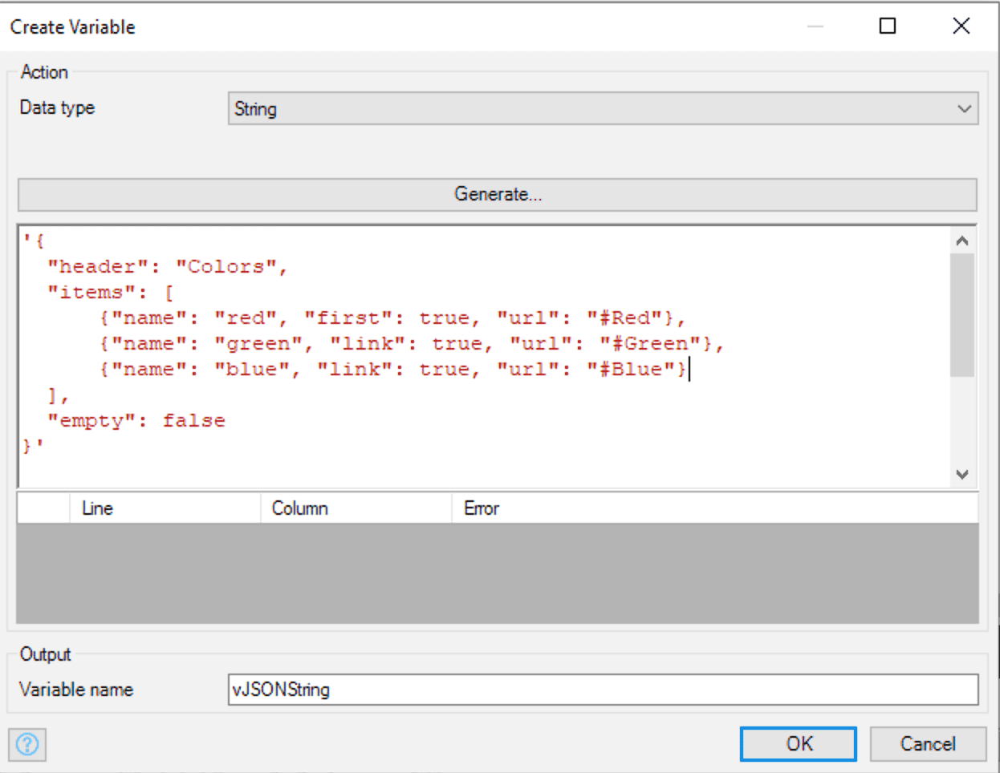
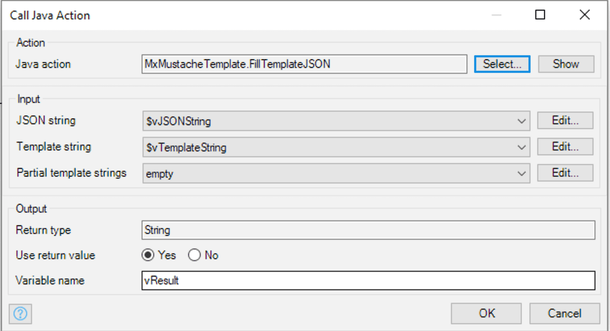

# MxMustacheTemplate

## Overview

This Mendix module provides an implementation of the [Mustache](https://mustache.github.io/) templating system for Mendix applications. 

## How to use the module

### Installing

The module can be installed directly from the App Store. Please assign the User security role to all roles that need to use this module.

### FillTemplateJSON

The module exposes a single Java Action called FillTemplateJSON. This takes a mustache template String, some JSON data, and some optional partial templates. This returns the populated template. It is recommended that JSON data is populated from Mendix using an Export Mapping. 

### A Simple Example.

The Java Action FillTemplateJSON in the USE_ME folder takes a template String and JSON String returning a String with the resuling populated template. In this case, pass empty to the Partial template strings input.

The data being passed looks like this

The template string looks like this

The data is passed to FillTemplateJSON like this

This will return the following String

    <h1>Colors</h1>

    <li><strong>red</strong></li>
    <li>red</li>
    <li>green</li>
    <li>blue</li>

### Partials

The module also supports the use of partial templates, so a template can be broken into reusable blocks.

To do this you need to populate Template entities and pass them as a List into FillTemplateJSON. The Template entity consists of a Name and a Template attribute. The Name attribute is what the partial template is called, and the name you need to call to bring it into your master template. The Template attribute is the actual Mustache template for the partial.

Taking the previous example, we can take the repeating list and make a partial template for this. We can set the Name of this to `listitem`, and the Template body to `<li>{{name}}</li>`.

Now to call this from the main template, we just use the following `{{> listitem}}`

## Bugs

There are no known bugs.

## Contributing

This module can be found on GitHub at [https://github.com/robertprice/MxMustacheTemplate](https://github.com/robertprice/MxMustacheTemplate).

Dependencies are managed using Maven.

The module is based on the Java implementation and also uses GSON internally to map JSON to a Java Hashmap.

### Unit Testing

There are Unit Tests in the UnitTesting directory. These return a boolean that is true if the test passed, or false if not. This means there is loose coupling to the UnitTesting module and tests are only run if this is available. Please only commit if all tests pass.

To run the unit tests install the Unit Testing and Object Handling modules from the Mendix App Store.

## See Also

* [Mustache Language Specification](https://mustache.github.io/mustache.5.html)
* [Mustache Java](https://github.com/spullara/mustache.java)
* [Google GSON](https://github.com/google/gson)

## Author

Robert Price - [robertprice.co.uk](https://www.robertprice.co.uk)